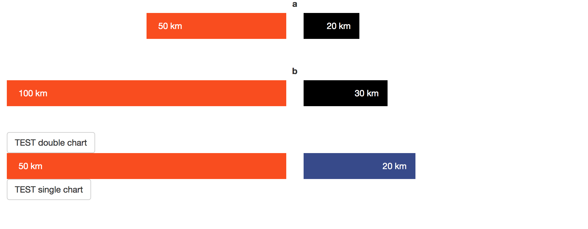

# A little app animating barplots upon clicking buttons



UI function
```r
barChartOutput(id="one",height="3em",color_right = "black"),

actionButton("test",labe="TEST double chart"),

barChartOutput(id="two",height="3em"),
  
actionButton("test2",labe="TEST single chart")

```

server function
```r

# First button observer creates two bars
observeEvent({
    input$test
  },{output$one <- renderBarChart({
    jsonlite::toJSON(list(left=c(50,100), right=c(20,30), unit="km",label=c("a","b")))
  })
  })
  
# second button observer creates a single bar
observeEvent({
  input$test2
},{output$two <- renderBarChart({
  jsonlite::toJSON(list(left=c(50), right=c(20), unit="km",label=c("a")))
})
})
```